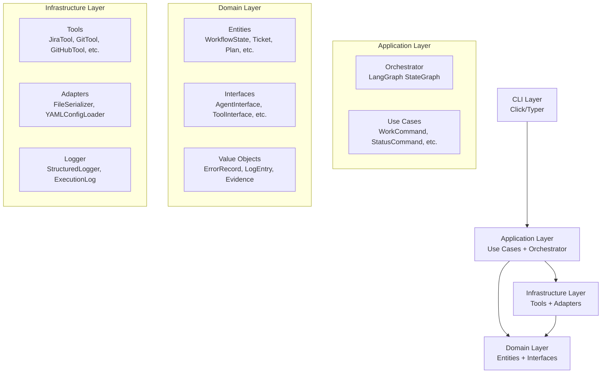
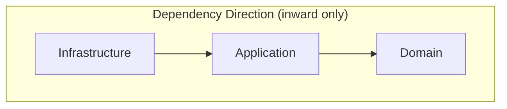
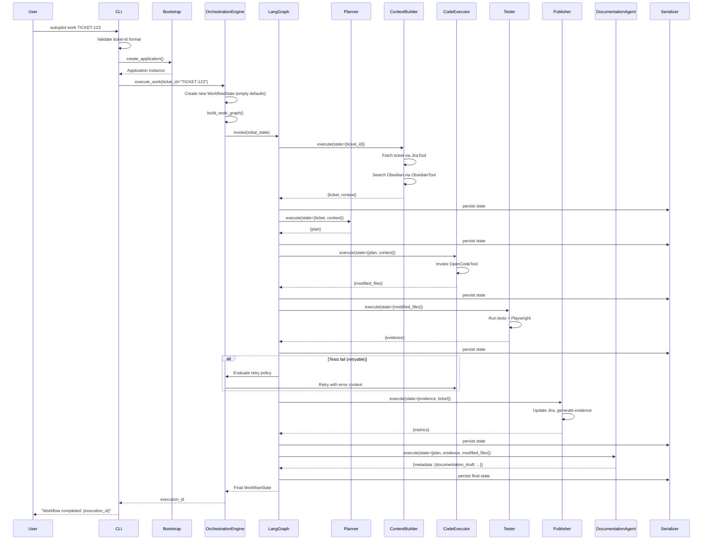
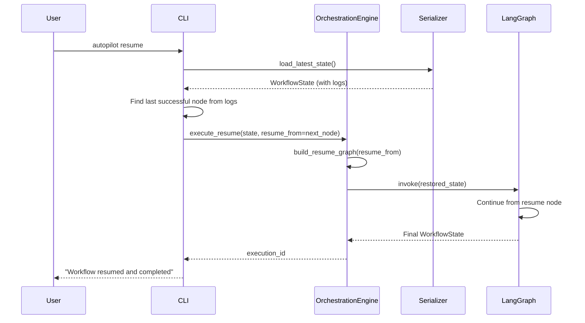
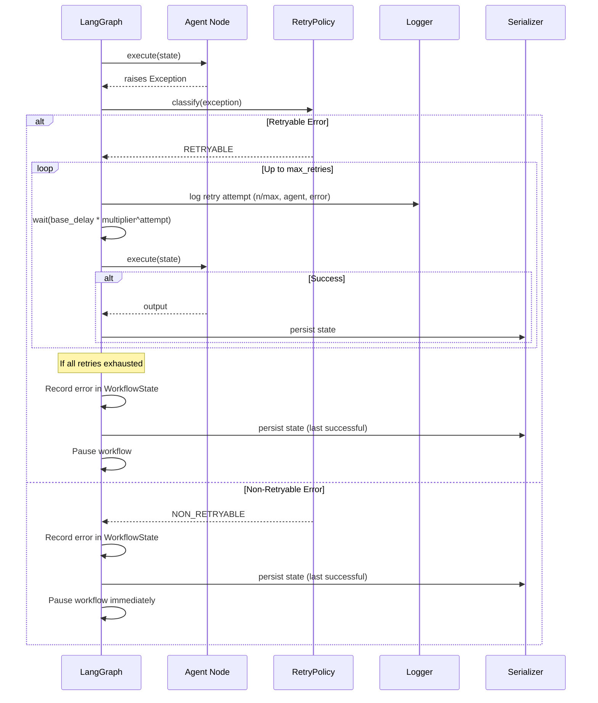
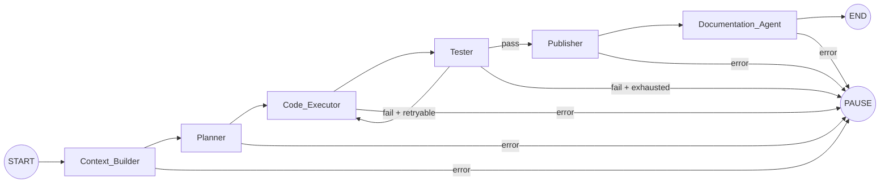

# Design Document: Autopilot

## Overview

Autopilot is a local developer workflow orchestration system that coordinates specialized agents and tools to automate the full development cycle — from ticket intake through implementation, testing, documentation, and publishing. It runs entirely on macOS without cloud infrastructure dependencies.

The system uses LangGraph's StateGraph as the orchestration engine, modeling workflows as directed graphs where each node is a specialized agent. Agents are thin coordination wrappers that delegate all domain logic to an independent tools layer. A shared `Workflow_State` typed object flows through the graph, accumulating data as each agent contributes its output.

**Key Design Decisions:**

- **LangGraph StateGraph** for orchestration: provides built-in state management, conditional edges, and graph compilation with minimal boilerplate
- **Clean Architecture** with three Python packages (`domain`, `application`, `infrastructure`): enforces dependency direction and testability
- **Constructor injection** for all dependencies: enables testing with mocks and future tool swaps
- **JSON serialization** for state persistence: supports pause/resume and inspection
- **Registry pattern** for agents and tools: allows extension without modification of existing code

## Architecture

### High-Level System Architecture



### Layered Dependency Diagram



- **Domain** imports only from Python standard library
- **Application** imports from Domain and standard library
- **Infrastructure** imports from Domain for interface contracts

### Package Structure

```
autopilot/
├── __init__.py
├── __main__.py              # Entry point: python -m autopilot
├── cli/
│   ├── __init__.py
│   └── commands.py          # CLI commands (work, status, resume, config, review)
├── domain/
│   ├── __init__.py
│   ├── entities/
│   │   ├── __init__.py
│   │   ├── workflow_state.py    # WorkflowState dataclass
│   │   ├── ticket.py           # Ticket entity
│   │   ├── plan.py             # Plan entity
│   │   └── config.py           # Config entity
│   ├── value_objects/
│   │   ├── __init__.py
│   │   ├── error_record.py     # ErrorRecord, ErrorType enum
│   │   ├── log_entry.py        # LogEntry, StepStatus enum
│   │   ├── evidence.py         # EvidenceItem
│   │   └── metrics.py          # Metrics
│   └── interfaces/
│       ├── __init__.py
│       ├── agent_interface.py   # AgentInterface protocol
│       ├── tool_interface.py    # ToolInterface protocol
│       ├── serializer.py        # SerializerInterface
│       └── config_loader.py     # ConfigLoaderInterface
├── application/
│   ├── __init__.py
│   ├── orchestrator/
│   │   ├── __init__.py
│   │   ├── engine.py           # LangGraph orchestration engine
│   │   ├── graph_builder.py    # Graph definitions (work, review, resume)
│   │   └── retry_policy.py     # Error classification + retry logic
│   ├── registries/
│   │   ├── __init__.py
│   │   ├── agent_registry.py   # AgentRegistry
│   │   └── tool_registry.py    # ToolRegistry
│   └── use_cases/
│       ├── __init__.py
│       ├── work_command.py      # WorkCommand use case
│       ├── status_command.py    # StatusCommand use case
│       ├── resume_command.py    # ResumeCommand use case
│       ├── config_command.py    # ConfigCommand use case
│       └── review_command.py    # ReviewCommand use case
├── infrastructure/
│   ├── __init__.py
│   ├── agents/
│   │   ├── __init__.py
│   │   ├── planner.py          # Planner agent
│   │   ├── context_builder.py  # ContextBuilder agent
│   │   ├── code_executor.py    # CodeExecutor agent
│   │   ├── reviewer.py         # Reviewer agent
│   │   ├── tester.py           # Tester agent
│   │   ├── publisher.py        # Publisher agent
│   │   └── documentation.py    # DocumentationAgent
│   ├── tools/
│   │   ├── __init__.py
│   │   ├── jira_tool.py        # JiraTool implementation
│   │   ├── git_tool.py         # GitTool implementation
│   │   ├── github_tool.py      # GitHubTool implementation
│   │   ├── obsidian_tool.py    # ObsidianTool implementation
│   │   ├── playwright_tool.py  # PlaywrightTool implementation
│   │   ├── opencode_tool.py    # OpenCodeTool implementation
│   │   └── filesystem_tool.py  # FilesystemTool implementation
│   ├── adapters/
│   │   ├── __init__.py
│   │   ├── json_serializer.py  # JSON serialization for WorkflowState
│   │   ├── yaml_config_loader.py # YAML config reader
│   │   └── structured_logger.py  # Logger implementation
│   └── bootstrap.py            # DI container / wiring
└── config.yaml                 # Default configuration file
```

## Components and Interfaces

### Agent Interface

All agents implement a common protocol that exposes metadata and a single execution method.

```python
from typing import Protocol, Any, Optional

class AgentInterface(Protocol):
    """Protocol that all agents must implement."""

    @property
    def name(self) -> str:
        """Unique string identifier for this agent."""
        ...

    @property
    def description(self) -> str:
        """Human-readable description of the agent's responsibility."""
        ...

    @property
    def input_schema(self) -> dict[str, type]:
        """Typed dictionary specification of required input fields from WorkflowState."""
        ...

    @property
    def output_schema(self) -> dict[str, type]:
        """Typed dictionary specification of output fields written to WorkflowState."""
        ...

    def execute(
        self,
        state: dict[str, Any],
        memory_context: Optional[dict[str, Any]] = None,
    ) -> dict[str, Any]:
        """
        Execute the agent's task.

        Args:
            state: Fields from WorkflowState matching input_schema.
            memory_context: Optional memory data for future memory-capable agents.

        Returns:
            Dictionary of output fields matching output_schema.

        Raises:
            Exception with original type preserved on failure.
        """
        ...
```

### Tool Interface

Tools provide access to external systems through a uniform interface.

```python
from typing import Protocol, Any
from dataclasses import dataclass


@dataclass
class ToolResult:
    """Structured result from tool execution."""
    success: bool
    data: Any | None = None
    error: str | None = None


class ToolInterface(Protocol):
    """Protocol that all tools must implement."""

    @property
    def name(self) -> str:
        """Unique string identifier for tool lookup."""
        ...

    @property
    def input_schema(self) -> dict[str, type]:
        """Expected input parameters."""
        ...

    @property
    def output_schema(self) -> dict[str, type]:
        """Expected output structure on success."""
        ...

    def execute(self, **kwargs: Any) -> ToolResult:
        """
        Execute the tool operation.

        Returns:
            ToolResult with success/failure status and data or error description.
        """
        ...
```

### Agent Registry

```python
class AgentRegistry:
    """Registry for agent discovery and retrieval."""

    def __init__(self) -> None:
        self._agents: dict[str, AgentInterface] = {}

    def register(self, agent: AgentInterface) -> None:
        """
        Register an agent by its name.

        Raises:
            ValueError: If an agent with the same name is already registered.
        """
        if agent.name in self._agents:
            raise ValueError(f"Agent already registered: {agent.name}")
        self._agents[agent.name] = agent

    def get(self, name: str) -> AgentInterface:
        """Retrieve an agent by name."""
        if name not in self._agents:
            raise KeyError(f"Agent not registered: {name}")
        return self._agents[name]

    def list_agents(self) -> list[str]:
        """Return all registered agent names."""
        return list(self._agents.keys())
```

### Tool Registry

```python
class ToolRegistry:
    """Registry for tool discovery and injection."""

    def __init__(self) -> None:
        self._tools: dict[str, ToolInterface] = {}

    def register(self, tool: ToolInterface) -> None:
        """Register a tool by its name."""
        self._tools[tool.name] = tool

    def get(self, name: str) -> ToolInterface:
        """
        Retrieve a tool by name.

        Raises:
            KeyError: If the tool name is not registered.
        """
        if name not in self._tools:
            raise KeyError(f"Tool not registered: {name}")
        return self._tools[name]
```

### Orchestration Engine

```python
from langgraph.graph import StateGraph, START, END

class OrchestrationEngine:
    """Builds and executes LangGraph workflows."""

    def __init__(
        self,
        agent_registry: AgentRegistry,
        serializer: SerializerInterface,
        logger: LoggerInterface,
        retry_policy: RetryPolicy,
        config: Config,
    ) -> None:
        self._agent_registry = agent_registry
        self._serializer = serializer
        self._logger = logger
        self._retry_policy = retry_policy
        self._config = config

    def build_work_graph(self) -> CompiledStateGraph:
        """Build the 'work' workflow graph."""
        ...

    def build_review_graph(self) -> CompiledStateGraph:
        """Build the 'review' workflow graph."""
        ...

    def build_resume_graph(self, resume_from: str) -> CompiledStateGraph:
        """Build a graph that resumes from a specific node."""
        ...

    def execute(self, graph: CompiledStateGraph, state: WorkflowState) -> WorkflowState:
        """Execute a compiled graph with the given initial state."""
        ...
```

### Dependency Injection Strategy

The system uses **constructor injection** wired in a single bootstrap module (`infrastructure/bootstrap.py`):

```python
def create_application() -> Application:
    """Wire all dependencies and return a configured Application."""
    # 1. Load config
    config_loader = YAMLConfigLoader()
    config = config_loader.load("config.yaml")

    # 2. Create tools
    jira_tool = JiraTool(config=config)
    git_tool = GitTool(config=config)
    github_tool = GitHubTool(config=config)
    obsidian_tool = ObsidianTool(config=config)
    playwright_tool = PlaywrightTool(config=config)
    opencode_tool = OpenCodeTool(config=config)
    filesystem_tool = FilesystemTool(config=config)

    # 3. Register tools
    tool_registry = ToolRegistry()
    for tool in [jira_tool, git_tool, github_tool, obsidian_tool,
                 playwright_tool, opencode_tool, filesystem_tool]:
        tool_registry.register(tool)

    # 4. Create agents (inject tools via constructor)
    planner = PlannerAgent(tool_registry=tool_registry)
    context_builder = ContextBuilderAgent(tool_registry=tool_registry)
    code_executor = CodeExecutorAgent(tool_registry=tool_registry)
    reviewer = ReviewerAgent(tool_registry=tool_registry)
    tester = TesterAgent(tool_registry=tool_registry)
    publisher = PublisherAgent(tool_registry=tool_registry)
    documentation = DocumentationAgent(tool_registry=tool_registry)

    # 5. Register agents
    agent_registry = AgentRegistry()
    for agent in [planner, context_builder, code_executor,
                  reviewer, tester, publisher, documentation]:
        agent_registry.register(agent)

    # 6. Create orchestrator
    logger = StructuredLogger(verbosity=config.verbosity)
    serializer = JSONSerializer(storage_path=config.workspace_location)
    retry_policy = RetryPolicy(
        max_retries=config.max_retries,
        base_delay=config.base_delay,
        backoff_multiplier=config.backoff_multiplier,
    )
    engine = OrchestrationEngine(
        agent_registry=agent_registry,
        serializer=serializer,
        logger=logger,
        retry_policy=retry_policy,
        config=config,
    )

    return Application(engine=engine, config=config, serializer=serializer)
```

## Data Models

### WorkflowState

```python
from dataclasses import dataclass, field
from typing import Any

@dataclass
class WorkflowState:
    """Shared state object that flows through the orchestration graph."""

    ticket: dict[str, Any] = field(default_factory=dict)
    context: dict[str, Any] = field(default_factory=dict)
    modified_files: list[str] = field(default_factory=list)
    plan: dict[str, Any] = field(default_factory=dict)
    logs: list[LogEntry] = field(default_factory=list)
    evidence: list[EvidenceItem] = field(default_factory=list)
    errors: list[ErrorRecord] = field(default_factory=list)
    metrics: dict[str, Any] = field(default_factory=dict)
    metadata: dict[str, Any] = field(default_factory=dict)
```

### LangGraph State Schema (TypedDict for graph nodes)

```python
from typing import TypedDict, Annotated
from typing_extensions import Required

def append_list(existing: list, new: list) -> list:
    """Reducer: append new items to existing list."""
    return existing + new

def overwrite(existing: Any, new: Any) -> Any:
    """Reducer: replace existing value with new value."""
    return new

class GraphState(TypedDict, total=False):
    """LangGraph state schema with reducers for merge strategy."""
    ticket: Annotated[dict, overwrite]
    context: Annotated[dict, overwrite]
    modified_files: Annotated[list[str], append_list]
    plan: Annotated[dict, overwrite]
    logs: Annotated[list[dict], append_list]
    evidence: Annotated[list[dict], append_list]
    errors: Annotated[list[dict], append_list]
    metrics: Annotated[dict, overwrite]
    metadata: Annotated[dict, overwrite]
```

### Config

```python
@dataclass
class Config:
    """Application configuration."""

    vault_location: str
    workspace_location: str
    available_mcps: list[str] = field(default_factory=list)  # max 20
    llm_model: str = ""           # max 100 chars
    llm_provider: str = ""        # max 50 chars
    timeout_seconds: int = 60     # range 1-600
    max_retries: int = 3          # range 0-10
    base_delay: float = 2.0       # seconds
    backoff_multiplier: float = 2.0
    verbosity: str = "normal"     # quiet | normal | verbose
```

### ErrorRecord

```python
from enum import Enum
from dataclasses import dataclass

class ErrorType(Enum):
    RETRYABLE = "retryable"
    NON_RETRYABLE = "non_retryable"

@dataclass
class ErrorRecord:
    """Record of an error during workflow execution."""
    error_type: ErrorType
    description: str
    agent_name: str
    attempt_count: int = 0
    exception_class: str = ""
```

### LogEntry

```python
from dataclasses import dataclass
from datetime import datetime
from enum import Enum

class StepStatus(Enum):
    SUCCESS = "success"
    FAILED = "failed"
    SKIPPED = "skipped"

@dataclass
class LogEntry:
    """Structured log entry for a single agent execution step."""
    agent_name: str
    start_time: datetime
    end_time: datetime
    elapsed_ms: int
    input_data: dict
    output_data: dict
    status: StepStatus
```

### EvidenceItem

```python
@dataclass
class EvidenceItem:
    """Evidence produced during workflow execution."""
    type: str          # "test_result", "screenshot", "log_file"
    description: str
    path: str | None = None
    data: dict | None = None
```

## Sequence Diagrams

### Work Command Flow



### Resume Command Flow



### Error Handling Flow



### Work Graph Definition



## State Management Approach

### State Flow Through the Graph

1. **Initialization**: `WorkflowState` is created with all fields at empty/default values
2. **Node Execution**: Each node receives only the fields declared in its `input_schema` (extracted from state)
3. **Merge Strategy**: After node completion, output is merged back:
   - **List fields** (`modified_files`, `logs`, `evidence`, `errors`): append semantics via LangGraph reducers
   - **Scalar/Object fields** (`ticket`, `context`, `plan`, `metrics`, `metadata`): overwrite semantics
4. **Persistence**: After each node completes, the full state is serialized to disk
5. **No Global State**: Each workflow execution creates a fresh `WorkflowState` instance

### Serialization Format

```json
{
  "ticket": {"id": "TICKET-123", "title": "...", "description": "..."},
  "context": {"related_docs": [], "obsidian_notes": []},
  "modified_files": ["src/feature.py", "tests/test_feature.py"],
  "plan": {"steps": [{"description": "...", "agent": "..."}]},
  "logs": [
    {"agent_name": "Context_Builder", "start_time": "...", "elapsed_ms": 1200, "status": "success"}
  ],
  "evidence": [
    {"type": "test_result", "description": "All tests pass", "data": {"passed": 12, "failed": 0}}
  ],
  "errors": [],
  "metrics": {"total_duration_ms": 45000, "steps_executed": 6},
  "metadata": {}
}
```

### Pause/Resume Mechanism

- **Pause**: On unrecoverable error or retry exhaustion, discard the failed agent's partial output, serialize the last-good state, and exit
- **Resume**: Deserialize the persisted state, inspect `logs` to find the last agent with `status: "success"`, build a graph starting from the next node

## Error Handling

### Error Classification

```python
class RetryPolicy:
    """Classifies errors and determines retry behavior."""

    RETRYABLE_EXCEPTIONS: set[type] = {
        TimeoutError,
        ConnectionError,
        TestFailureError,      # custom: test suite failures
        ToolTimeoutError,      # custom: tool execution timeout
    }

    NON_RETRYABLE_EXCEPTIONS: set[type] = {
        AuthenticationError,   # custom: auth failures
        ConfigurationError,    # custom: missing config
        SchemaViolationError,  # custom: data contract violation
    }

    def classify(self, exception: Exception) -> ErrorType:
        """Classify an exception as retryable or non-retryable."""
        for exc_type in self.RETRYABLE_EXCEPTIONS:
            if isinstance(exception, exc_type):
                return ErrorType.RETRYABLE
        return ErrorType.NON_RETRYABLE

    def get_delay(self, attempt: int) -> float:
        """Calculate delay with exponential backoff."""
        return self.base_delay * (self.backoff_multiplier ** attempt)
```

### Error Handling Rules

1. **Retryable errors**: Retry up to `max_retries` with exponential backoff (`base_delay * multiplier^attempt`)
2. **Non-retryable errors**: Immediate pause, no retry
3. **Partial output**: On failure, the failed agent's output is discarded; state reflects last successful step
4. **Error recording**: All errors stored in `WorkflowState.errors` with type, description, agent name, and attempt count
5. **Logging**: Each retry attempt is logged with attempt number, max attempts, agent name, and error description

## Correctness Properties

*A property is a characteristic or behavior that should hold true across all valid executions of a system — essentially, a formal statement about what the system should do. Properties serve as the bridge between human-readable specifications and machine-verifiable correctness guarantees.*

### Property 1: WorkflowState serialization round-trip

*For any* valid `WorkflowState` object (with arbitrary values in ticket, context, modified_files, plan, logs, evidence, errors, metrics, and metadata fields), serializing to JSON and then deserializing SHALL produce an object with field-by-field equality to the original.

**Validates: Requirements 5.4, 12.6, 13.1, 13.2, 13.3**

### Property 2: Config validation accepts valid values and rejects invalid values

*For any* configuration field value, the Config_Loader SHALL accept values within the defined constraints (MCPs ≤ 20, model ≤ 100 chars, provider ≤ 50 chars, timeout in [1, 600], max_retries in [0, 10]) and reject values outside those constraints with an error indicating the field name, provided value, and expected constraint.

**Validates: Requirements 6.2, 6.5**

### Property 3: Environment variable override

*For any* config field and corresponding environment variable `AUTOPILOT_<FIELD_NAME>`, the environment variable value SHALL take precedence over the YAML file value when both are present.

**Validates: Requirements 6.6**

### Property 4: Agent registry uniqueness and non-interference

*For any* set of agents with unique names, registering all of them SHALL succeed with each agent retrievable by name; and *for any* agent name already registered, attempting to register a second agent with the same name SHALL raise an error. Adding a new agent SHALL not alter the metadata of previously registered agents.

**Validates: Requirements 2.5, 2.6**

### Property 5: Tool registry lookup failure

*For any* tool name that is not registered in the Tool_Registry, requesting that name SHALL raise an error that includes the unregistered tool name in the message.

**Validates: Requirements 4.6**

### Property 6: Agent input extraction

*For any* agent with a declared input_schema and *for any* WorkflowState containing additional fields beyond the schema, the Orchestrator SHALL extract and pass only the fields declared in the agent's input_schema — no extra fields.

**Validates: Requirements 2.2**

### Property 7: State merge semantics

*For any* WorkflowState and *for any* agent output, merging SHALL append values to list fields (modified_files, logs, evidence, errors) and overwrite scalar/object fields (ticket, context, plan, metrics, metadata). After merge, list fields SHALL equal the original list concatenated with the new items.

**Validates: Requirements 5.2**

### Property 8: Retryable error retry count

*For any* retryable exception and *for any* max_retries value in [1, 10], the Orchestrator SHALL invoke the failed agent exactly up to max_retries additional times before pausing the workflow. The delay between attempt N and N+1 SHALL equal `base_delay * backoff_multiplier^N`.

**Validates: Requirements 8.1, 8.5**

### Property 9: Non-retryable error immediate pause

*For any* non-retryable exception (authentication failure, missing configuration, schema violation), the Orchestrator SHALL perform zero retry attempts and immediately pause the workflow, persisting the last-good state.

**Validates: Requirements 8.3**

### Property 10: Error classification determinism

*For any* Python exception type, the RetryPolicy SHALL consistently classify it as either retryable or non-retryable. The classification SHALL depend only on the exception type, not on runtime state.

**Validates: Requirements 8.6**

### Property 11: Failed agent output discarded on pause

*For any* workflow pause triggered by error, the persisted WorkflowState SHALL equal the state as it existed after the last successfully completed agent — no partial output from the failed agent SHALL be present.

**Validates: Requirements 8.7**

### Property 12: Resume point identification

*For any* persisted WorkflowState with an execution log containing at least one step with status "success", the resume command SHALL identify the correct resume node as the first node after the last node with status "success" in execution order.

**Validates: Requirements 1.3, 13.4**

### Property 13: Deserialization error reporting

*For any* malformed JSON input (invalid syntax, missing required fields, or wrong field types), the Deserializer SHALL return an error that indicates the failure type (parse error or schema violation) and the field path or character offset where validation failed.

**Validates: Requirements 13.5**

### Property 14: State persistence after each node

*For any* multi-node workflow execution, the Serializer SHALL be invoked exactly once after each agent node completes successfully, before the next node begins execution.

**Validates: Requirements 13.6**

### Property 15: Execution order matches graph topology

*For any* workflow graph definition and *for any* successful execution, the order of agent invocations recorded in the execution log SHALL match the topological order defined by the graph edges.

**Validates: Requirements 3.2, 11.10**

### Property 16: Logger format invariant

*For any* agent name and execution result (success, failed, skipped), the Logger completion entry SHALL contain the agent name, elapsed time in milliseconds, and the status value.

**Validates: Requirements 7.1, 7.2**

### Property 17: Execution log completeness

*For any* recorded step in the Execution_Log, the entry SHALL contain all required fields: agent name, start timestamp, end timestamp, elapsed time in milliseconds, input data, output data, and status value.

**Validates: Requirements 7.3**

### Property 18: Execution log queryability

*For any* Execution_Log with N entries, querying by agent name SHALL return exactly the entries with that agent name; querying by status SHALL return exactly the entries with that status; and results SHALL be orderable by step execution order.

**Validates: Requirements 7.5**

### Property 19: Domain layer import constraint

*For any* Python module in the domain package, the module's import statements SHALL reference only the Python standard library or other modules within the domain package — never the application or infrastructure packages.

**Validates: Requirements 10.2, 10.6**

### Property 20: Application layer import constraint

*For any* Python module in the application package, the module's import statements SHALL reference only the Python standard library, the domain package, or other modules within the application package — never the infrastructure package.

**Validates: Requirements 10.3, 10.7**

### Property 21: Memory-transparent agent behavior

*For any* agent (memory-capable or not), executing with `memory_context=None` SHALL produce identical results to executing without the memory_context parameter. Registration of memory-capable agents SHALL use the same mechanism as non-memory agents.

**Validates: Requirements 12.4, 12.5**

### Property 22: Conditional edge routing

*For any* WorkflowState containing a condition field value that maps to a conditional edge, the Orchestrator SHALL route execution to the node specified by that condition — not any other branch.

**Validates: Requirements 3.6**

### Property 23: Tool result structure invariant

*For any* Tool execution (success or failure), the returned ToolResult SHALL contain a boolean `success` field, and either `data` (when success=True) or `error` description (when success=False).

**Validates: Requirements 4.7**

### Property 24: CLI exit code invariant

*For any* CLI command execution, the process SHALL exit with code 0 on success and a non-zero exit code on failure.

**Validates: Requirements 1.7**

### Property 25: Config missing field error reporting

*For any* required configuration field that is absent from the YAML file (and not overridden by environment variable), the Config_Loader SHALL produce an error message that names the missing field.

**Validates: Requirements 6.3**

## Testing Strategy

### Unit Testing

- **Domain layer**: Pure data classes and value objects — test construction, validation, equality
- **Application layer**: Orchestrator logic, registries, use cases — test with mocked tools and agents
- **Infrastructure layer**: Tool implementations — test with mocked external APIs
- **Error handling**: Test classification logic, retry counting, backoff calculation
- **Serialization**: Test round-trip for known state instances, error cases for malformed JSON

### Property-Based Testing

Property-based testing is well-suited for this project because:
- `WorkflowState` serialization has a clear round-trip property (Property 1)
- Config validation has universal constraints over ranges and lengths (Properties 2, 3, 25)
- Registries have invariants: uniqueness, lookup consistency, error reporting (Properties 4, 5)
- State merge logic has algebraic properties: append for lists, overwrite for scalars (Property 7)
- Error handling has deterministic classification and retry behavior (Properties 8, 9, 10, 11)
- Layer import constraints are statically verifiable (Properties 19, 20)

**Library**: [Hypothesis](https://hypothesis.readthedocs.io/) (Python PBT standard)
**Minimum iterations**: 100 per property test
**Tag format**: `Feature: autopilot, Property {number}: {property_text}`

Each correctness property above maps to a single property-based test function. The test generates random valid inputs using Hypothesis strategies and verifies the property holds universally.

### Integration Testing

- **End-to-end workflow**: Execute a full `work` graph with mocked tools to verify ordering and state flow
- **CLI**: Test command parsing, exit codes, error messages
- **Config loading**: Test YAML parsing, env var overrides, validation errors
- **Resume flow**: Persist state, simulate failure, verify resume from correct node
- **Tool invocation**: Verify agents call tools through registry, not directly
- **Logger persistence**: Verify JSON execution log is written to filesystem

